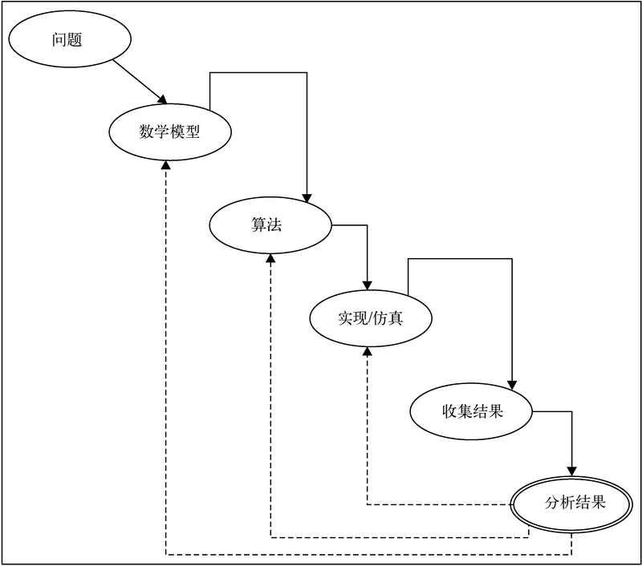

# 科学计算篇

python是一门应用领域非常广泛的编程语言,但现今最为人所知的应用领域应该就是科学计算领域了.

本篇就是介绍相应工具的篇章.本文不是讲数学,统计,算法的文章,因此不会太过具体的介绍这些工具的理论基础,更多的是会在实现角度和应用角度做出介绍.

## 科学计算综述

科学计算(scientific computing)是指在科学与工程领域使用计算机数学建模和数值分析技术分析和解决问题的过程.

科学问题包括不同科学学科中的问题,如地球科学,空间科学,社会科学,生命科学,物理学和形式科学.这些学科基本涵盖了现有的所有科学领域,从传统科学到现代工程科学,如计算机科学,都在其中.工程问题包括从土木工程和电子工程到(最新的)生物医学工程领域的各种问题.因此数据科学,机器学习这些其实也是和科学计算由交叉的,它们处理连续型数据时也是使用的科学计算的方法.

科学计算也被称作计算科学(computational science)或科学计算法(scientific computation)，其主要思路是开发数学模型,通过量化分析技术和计算机解决科学问题.

科学计算是一门由科学/工程,数学/统计,计算机科学组成的交叉学科,需要人们了解问题(业务领域)背后的专业知识,同时需要具有数学建模能力,掌握各种数值分析技术,并能利用计算机技术实现高效率,高性能的计算工具.它还需要使用计算机以及各种各样的外围设备,此外还需要掌握编程语言,并了解问题所在领域的知识数据库.人们已经利用科学计算的相关技术创造出了新的应用,让科学家们能够从现有的数据和过程中发现新的知识.

### 科学计算的工作流

通常科学计算的工作流如下:

1. `建模`,通过抽象简化问题为问题设计数学模型.
2. `开发算法`,算法通常需要利用合适的编程语言和恰当的实现框架来实现.
3. `样本仿真`,通过实现算法并在样本范围内执行模拟来做仿真实验.
4. `收集数据`,对仿真后的结果进行收集整理
5. `仿真结果分析`,对仿真的结果进行性能和准确率分析,如果实现的结果或效果不符合预期则应该确定问题的根源.然后回头到建模或者算法部分做改进或替换.

科学计算工作流中处理的都是连续型数据,比如速度加速度,温度...使用的技术被称作[数值分析](https://baike.baidu.com/item/%E6%95%B0%E5%80%BC%E5%88%86%E6%9E%90/3781?fr=aladdin)
一般情况下连续变量的数学问题只能获得近似解,因为它们的精确解不太可能在有限的步骤中得到.因此这些问题通过有限步的迭代处理可以收敛到一个可行解.这个可行解取决于目标问题的特性.通常迭代步骤都是有限的,每次迭代之后结果都会更加接近仿真的期望解.仿真结果的准确性和算法的收敛速度是科学计算过程的重点.

### 科学计算中解决复杂问题的基本策略

解决复杂计算问题的一个简单策略是分治法--将复杂问题拆解为多个简单问题的组合,然后逐一解决这些简单问题.这一基本策略有两个关键点需要注意

1. 需要从同类问题中寻找可以解决的问题(相似性替代,切忌使用风马牛不相及的问题).
2. 问题替换之后,需要考虑最终问题是否仍然处于可接受的范围之类.

比如将无限维空间问题简化为有限维空间问题;将无限过程转换成有限过程,例如将积分和无穷级数转换成有限项求和或有限差分法(网格法);如果条件允许,用代数方程代替差分方程;将非线性问题转换成线性问题,因为后者更容易解决;如果条件允许,将复杂的函数简化成若干简单的函数.

## Python做科学计算的工具链

常见的相关工具包括:

+ 专用数据结构和类型
    
    主要是由[numpy](http://www.numpy.org/)和[pandas](http://pandas.pydata.org/)提供,也因此这两个工具从成了python数据科学的基石.这两个工具除了实现了数据类型外也实现了一些算法,在多数时候也已经够用.

    + 同构定长多维数组工具numpy.dnarry

    + 结构化数据表DataFrame实现pandas.DataFrame
    
    + 序列对象pandas.Series

+ 计算框架
    
    通常这类框架是某种理论框架的延续,也就是说算出结果只是附带的事情,这些框架关心的其实更多的是如何实现计算这一过程,虽然未必应用广泛但通常也没有替代品
    + 数值计算框架[numpy](https://numpy.org/)和[scipy](https://docs.scipy.org/doc/scipy/reference/)
    + 符号计算框架[Sympy](http://www.sympy.org/en/index.html)
    + 贝叶斯推断框架[Pymc3](http://docs.pymc.io/index.html)
    + 分布式计算框架[dask](https://dask.org/)
    + 可以利用gpu的计算框架[pytorch](https://pytorch.org/)

+ 算法封装

    + 机器学习算法包[sklearn](http://scikit-learn.org/stable/)
    + 专业统计工具包[Statsmodels](http://www.statsmodels.org/stable/index.html)
    + 复杂网络计算框架[networkx](http://networkx.github.io/)以及`C/C++`实现的[igraph](http://igraph.org/)

+ 数据可视化工具

    + 最通用的可视化框架[matplotlib](https://matplotlib.org/)
    + matplotlib之上的封装[seaborn](http://seaborn.pydata.org/)

## 本篇内容

本文会分为如下内容:

+ 使用python做计算:

  + 数值计算
  + 符号计算
  + 概率推理

+ 数据可视化

+ 不同领域的应用

  + 数据科学
  + 机器学习
  <!-- + 模拟仿真 -->
  + 复杂网络分析

同时由于这部分理论性专业性很强,还额外有一个术语表用于记录上面部分用到的概念.